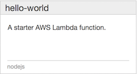
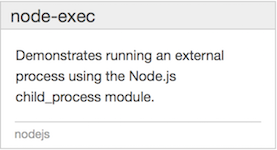

## AWS Lambda でシェル芸

### 第 23 回シェル芸勉強会 大阪サテライト LT
### 2016/6/18
### so

>>>

Powered by
* [reveal.js](https://github.com/hakimel/reveal.js/)
* [GitHub Pages](https://horo17.github.io/lambdash-slide/)

>>>

## `$ whoami`


* so@fenrir
	* インフラ/オペレーションエンジニア
	* AWS Certified Solutions Architect - Professional
		* 好きなサービスは AWS Lambda
* Twitter: @3socha

---

## `$ man AWS Lambda`


* AWS 上で小規模なコードを実行するサービス
* 利用可能な言語
	* Node.js v0.10.36, v4.3.2
	* Java 8
	* Python 2.7
* サーバの用意、管理が不要なマネージドサービス
* イベントドリブンで実行

>>>

## AWS Lambda の料金体系

* 実行にかかった時間 × 割り当てメモリ量で課金
	* メモリ：128MB ~ 1,536MB から選択
	* 時間：100 ミリ秒単位の切り上げ
	* 128MB × 100ms -> $0.000000208
* 1か月に 400,000 GB/秒まで無料

>>>

## AWS Lambda の一般的な用途

* AWS 上で発生したイベントをチャットに通知
* Amazon S3 にアップロードされた画像を変換
	* ImageMagick が入ってる
* Amazon API Gateway と組み合わせて Web API
* モバイルアプリのバックエンド

---

## Lambda function の例



source 

```javascript
'use strict';
console.log('Loading function');

exports.handler = (event, context, callback) => {
    //console.log('Received event:', JSON.stringify(event, null, 2));
    console.log('value1 =', event.key1);
    console.log('value2 =', event.key2);
    console.log('value3 =', event.key3);
    callback(null, event.key1);  // Echo back the first key value
    // callback('Something went wrong');
};
```

>>>

event

```json
{
  "key3": "value3",
  "key2": "value2",
  "key1": "value1"
}
```

result

```text
"value1"
```

output

```text
START RequestId: 578e802e-3519-11e6-8f3e-6bfeb4a801f9 Version: $LATEST
2016-06-18T05:56:04.101Z    578e802e-3519-11e6-8f3e-6bfeb4a801f9    value1 = value1
2016-06-18T05:56:04.102Z    578e802e-3519-11e6-8f3e-6bfeb4a801f9    value2 = value2
2016-06-18T05:56:04.102Z    578e802e-3519-11e6-8f3e-6bfeb4a801f9    value3 = value3
END RequestId: 578e802e-3519-11e6-8f3e-6bfeb4a801f9
REPORT RequestId: 578e802e-3519-11e6-8f3e-6bfeb4a801f9  Duration: 1.04 ms   Billed Duration: 100 ms     Memory Size: 128 MB Max Memory Used: 36 MB  
```

>>>

## Lambda function の例 2



source

```javascript
'use strict';
let exec = require('child_process').exec;

exports.handler = (event, context, callback) => {
    if (!event.cmd) {
        return callback('Please specify a command to run as event.cmd');
    }
    const child = exec(event.cmd, (error) => {
        // Resolve with result of process
        callback(error, 'Process complete!');
    });

    // Log process stdout and stderr
    child.stdout.on('data', console.log);
    child.stderr.on('data', console.error);
};
```

>>>

event

```json
{
  "cmd": "uname -a"
}
```

result

```text
"Process complete!"
```

output

```text
START RequestId: 12b8789b-351a-11e6-8217-4d7f4fc12adb Version: $LATEST
2016-06-18T06:01:18.132Z    12b8789b-351a-11e6-8217-4d7f4fc12adb    Linux ip-10-11-67-174 4.1.19-24.31.amzn1.x86_64 #1 SMP Tue Mar 15 23:41:50 UTC 2016 x86_64 x86_64 x86_64 GNU/Linux

END RequestId: 12b8789b-351a-11e6-8217-4d7f4fc12adb
REPORT RequestId: 12b8789b-351a-11e6-8217-4d7f4fc12adb  Duration: 21.88 ms  Billed Duration: 100 ms     Memory Size: 128 MB Max Memory Used: 17 MB  
```

>>>

## AWS Lambda でも任意のコマンドが実行可能

---

## ＿人人人人人人人人人人＿
## ＞　AWS Lambda で 　＜
## ＞　シェル芸がしたい　＜
## ￣Y^Y^Y^Y^Y^Y^Y^Y^￣

>>>

## シェル芸の定義バージョン1.1

> マウスも使わず、ソースコードも残さず、GUIツールを立ち上げる間もなく、あらゆる調査・計算・テキスト処理をCLI端末へのコマンド入力一撃で終わらすこと。あるいはそのときのコマンド入力のこと。

* https://blog.ueda.asia/?page_id=1434

>>>

## シェル芸の定義 v1.1 に準拠する

---

## [alestic/lambdash](https://github.com/alestic/lambdash)

* [lambdash: AWS Lambda Shell Hack: New And Improved! | Alestic.com](https://alestic.com/2015/06/aws-lambda-shell-2/)
* [AWS Lambda で対話的にコマンドを実行できる lambdash を触ってみた ｜ Developers.IO](http://dev.classmethod.jp/cloud/aws/lambdash/)

>>>

## Setup

```sh
$ git clone git@github.com:alestic/lambdash.git
$ cd lambdash
$ ./lambdash-install
```

* `lambdash.template` を元に、CloudFormation の Stack を実行
* 必要に応じてリージョン、メモリサイズ、実行時間を変更
* ただしこれだけでは動かないので、少しだけがんばる必要があるが、省略

>>>

## Install

```sh
$ curl -LO https://raw.githubusercontent.com/alestic/lambdash/master/lambdash
$ chmod +x lambdash
$ pip install boto3
```

* lambdash スクリプトを落として実行権限を付与
* `PATH` を通す
* 必要な Python ライブラリもインストール

```sh
$ export LAMBDASH_FUNCTION=lambdash-function-ABC123EXAMPL
```

* 作成された Lambda Function 名を環境変数にセット
* `~/.bashrc` にでも書いておく

---

## lambdash を使ってみる

>>>

```sh
$ lambdash uname -a
Linux ip-10-11-67-174 4.1.19-24.31.amzn1.x86_64 #1 SMP Tue Mar 15 23:41:50 UTC 2016 x86_64 x86_64 x86_64 GNU/Linux
```

```sh
$ lambdash 'echo $PATH'
/usr/local/lib64/node-v4.3.x/bin:/usr/local/bin:/usr/bin/:/bin
```

```sh
$ lambdash curl -s http://checkip.amazonaws.com/
54.83.169.141
```

>>>

## シェル芸の定義 v1.1 に準拠

* 標準は大事だよね

>>>

## できそうな事を確認

```sh
$ lambdash pwd
/var/task
```

```sh
$ lambdash ls -l
total 4
-rw-rw-r-- 1 slicer 497 688 Jun 17 19:18 index.js
```

* ホームディレクトリには Lambda Function のソース

```sh
$ lambdash df -h
Filesystem      Size  Used Avail Use% Mounted on
/dev/xvda1       30G  2.7G   27G  10% /
/dev/loop2      526M  440K  514M   1% /tmp
```

* コンテナ上で動作し、Lambda Function から書き込めるのは `/tmp` のみ
* 512MB 程度

>>>

## XX のコマンドが実行できない

* 権限的に実行できないものは諦める

```sh
$ lambdash jq -v
/bin/sh: jq: command not found
```

* 存在しないコマンドはソースと一緒にアップロード

>>>

## `jq` を lambdash 使う

* [./jq](https://stedolan.github.io/jq/) から Linux 版をダウンロード

```sh
$ tree
.
├── bin
│   └── jq
└── index.js
```

```sh
$ zip -r lambdash-with-jq.zip .
```

* zip で固めて AWS Lambda にアップロード
* lambdash で使う Lambda Function を変更

```sh
$ export LAMBDASH_FUNCTION=lambdash-with-jq
```

```sh
$ lambdash ls -F
bin/
index.js
```

```sh
$ lambdash 'PATH=$PATH:`pwd`/bin; jq --version'
jq-1.5
```

---

## できそうな事を確認 2

```sh
$ lambdash 'rpm -qa | grep -i python'
python27-libs-2.7.10-4.120.amzn1.x86_64
python27-pyxattr-0.5.0-1.6.amzn1.x86_64
python34-3.4.3-1.30.amzn1.x86_64
python27-pygpgme-0.3-9.12.amzn1.x86_64
python27-urlgrabber-3.9.1-9.13.amzn1.noarch
python27-2.7.10-4.120.amzn1.x86_64
python27-pyliblzma-0.5.3-11.6.amzn1.x86_64
python27-iniparse-0.3.1-2.1.9.amzn1.noarch
python34-libs-3.4.3-1.30.amzn1.x86_64
rpm-python27-4.11.2-2.73.amzn1.x86_64
python27-pycurl-7.19.0-17.12.amzn1.x86_64
```

* Python 3.4 利用可

>>>

```sh
$ lambdash 'rpm -qa | grep -i java-1'
java-1.8.0-openjdk-headless-1.8.0.77-0.b03.9.amzn1.x86_64
java-1.7.0-openjdk-1.7.0.99-2.6.5.0.66.amzn1.x86_64
java-1.8.0-openjdk-1.8.0.77-0.b03.9.amzn1.x86_64
```

>>>

* perl 

```sh
$ lambdash 'rpm -qa | grep -i perl'
perl-HTTP-Tiny-0.033-3.6.amzn1.noarch
perl-Pod-Perldoc-3.20-4.7.amzn1.noarch
perl-Pod-Escapes-1.04-283.37.amzn1.noarch
perl-Pod-Usage-1.63-3.5.amzn1.noarch
perl-Scalar-List-Utils-1.27-248.5.amzn1.x86_64
perl-threads-1.87-4.5.amzn1.x86_64
perl-Carp-1.26-244.5.amzn1.noarch
perl-Storable-2.45-3.5.amzn1.x86_64
perl-File-Path-2.09-2.5.amzn1.noarch
perl-PathTools-3.40-5.5.amzn1.x86_64
perl-libs-5.16.3-283.37.amzn1.x86_64
perl-Getopt-Long-2.40-2.5.amzn1.noarch
perl-5.16.3-283.37.amzn1.x86_64
perl-parent-0.225-244.5.amzn1.noarch
perl-podlators-2.5.1-3.8.amzn1.noarch
perl-Text-ParseWords-3.29-4.5.amzn1.noarch
perl-Encode-2.51-7.5.amzn1.x86_64
perl-macros-5.16.3-283.37.amzn1.x86_64
perl-Filter-1.49-3.5.amzn1.x86_64
perl-constant-1.27-2.5.amzn1.noarch
perl-Time-Local-1.2300-2.5.amzn1.noarch
perl-Exporter-5.68-3.5.amzn1.noarch
perl-File-Temp-0.23.01-3.5.amzn1.noarch
perl-Socket-2.010-3.5.amzn1.x86_64
perl-Pod-Simple-3.28-4.6.amzn1.noarch
perl-threads-shared-1.43-6.5.amzn1.x86_64
perl-Thread-Queue-3.02-2.5.amzn1.noarch
```

>>>

```sh
$ lambdash perl -v

This is perl 5, version 16, subversion 3 (v5.16.3) built for x86_64-linux-thread-multi
(with 25 registered patches, see perl -V for more detail)

Copyright 1987-2012, Larry Wall

Perl may be copied only under the terms of either the Artistic License or the
GNU General Public License, which may be found in the Perl 5 source kit.

Complete documentation for Perl, including FAQ lists, should be found on
this system using "man perl" or "perldoc perl".  If you have access to the
Internet, point your browser at http://www.perl.org/, the Perl Home Page.
```

>>>

```sh
$ lambdash 'rpm -qa | grep ImageMagick'
ImageMagick-6.7.8.9-13.20.amzn1.x86_64
```

---

## AWS Lambda の特性を活かす

>>>

## 制限されたコンテナ上で動作するので安全(?)

* 実行時間を超えると殺される
* アクセスできる範囲が限定されている
* VPC 内で起動すれば Security Group で通信も制限可能

>>>

## `:(){ :|:& };:`

>>>

```sh
$ lambdash ':(){ :|:& };:'
/bin/sh: `:': not a valid identifier
```

>>>

```sh
$ echo ':(){ :|:& };:' | sed -e 's/\:/l/g' | xargs lambdash
```

注: [forkbomb](https://ja.wikipedia.org/wiki/Fork%E7%88%86%E5%BC%BE) です

実行される場合は自己責任でお願いします

---

## AWS Lambda 補足

* 実行開始までに時間がかかることがある
    * しばらく動いていない Lambda Function 用コンテナは落とされる
    * コンテナの起動、ENI のプロビジョニングに少し時間がかかる
    * まぁサーバ起動するより早いよ
